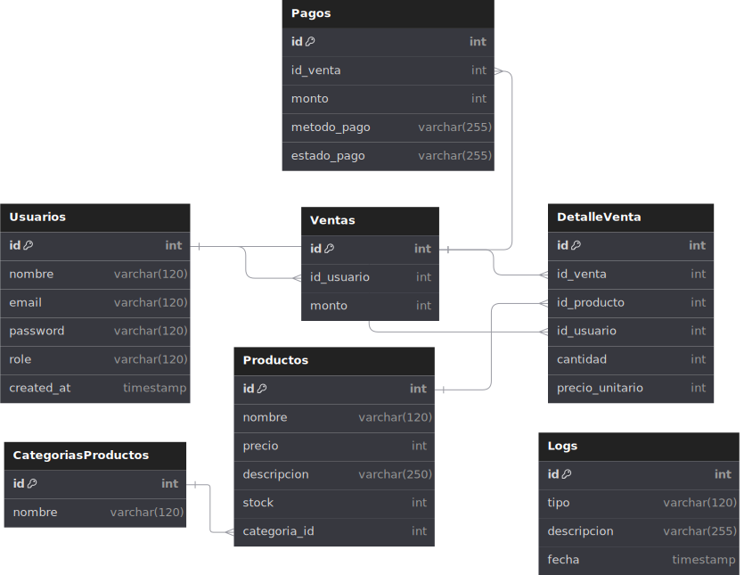
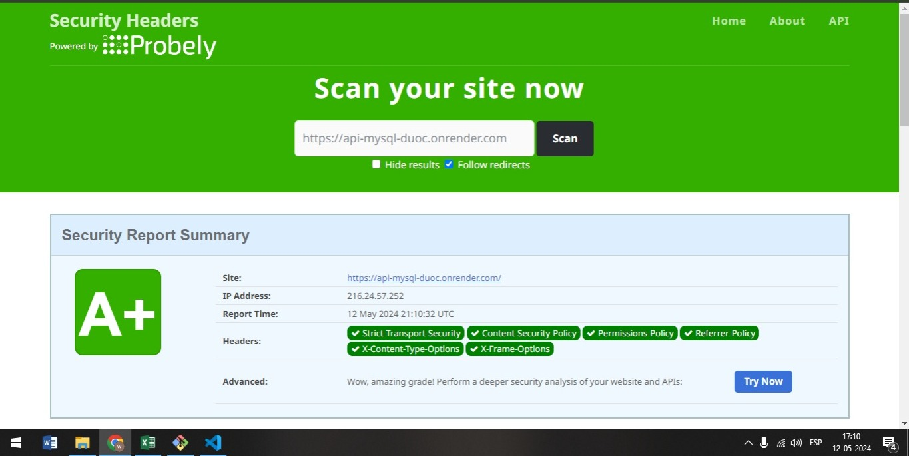

# Aplicación Web Node.js Express con Base de Datos MySQL

Este repositorio contiene una aplicación web desarrollada con Node.js y Express, utilizando una base de datos MySQL alojada en AWS. La aplicación proporciona servicios para gestionar usuarios, productos, ventas, pagos, historial de compras y carrito de compras.

### Proyecto Duoc-Uc
**URL**
```
https://api-mysql-duoc.onrender.com
```
Nota: Por estar utilizando la capa gratuita en Render, el tiempo de carga puede ser de hasta 60 segundos después de un período de inactividad.


Este proyecto es parte del curso de Integracion de Plataformas, Duoc-UC.

## Configuración de la Base de Datos

La base de datos utilizada en esta aplicación cuenta con las siguientes tablas:

- **Usuarios**: Almacena información sobre los usuarios registrados en la plataforma.
- **CategoriasProductos**: Contiene las categorías de productos disponibles.
- **Productos**: Guarda los detalles de los productos disponibles para la venta.
- **Ventas**: Registra las ventas realizadas por los usuarios.
- **DetalleVenta**: Almacena los detalles de cada venta realizada, incluyendo los productos vendidos.
- **Pagos**: Registra los pagos asociados a cada venta.
- **Logs**: Contiene registros de eventos y acciones importantes dentro de la aplicación.



## Ejecución del Servidor

Para ejecutar el servidor de la aplicación, sigue estos pasos:

1. Clona este repositorio en tu máquina local.
2. Instala las dependencias utilizando el comando `npm install`.
3. Configura las variables de entorno necesarias, como el puerto y las credenciales de la base de datos.
4. Ejecuta el servidor con el comando `npm start`.

## Endpoints Disponibles

La aplicación proporciona los siguientes endpoints para interactuar con la API:

- `/login`: Endpoint para iniciar sesión en la plataforma.
- `/productos`: Endpoint para gestionar productos.
- `/pagos`: Endpoint para realizar pagos.
- `/historial-compras`: Endpoint para visualizar el historial de compras.
- `/carrito`: Endpoint para gestionar el carrito de compras.

## Middleware de Seguridad

La aplicación utiliza varios middleware de seguridad para protegerse contra amenazas comunes, como:

- `helmet`: Ayuda a configurar cabeceras HTTP para mejorar la seguridad.
- `morgan`: Registra los logs de las solicitudes HTTP.
- `body-parser`: Analiza los cuerpos de las solicitudes HTTP.
- `express-session`: Gestiona las sesiones de usuario.
- `passport`: Middleware de autenticación para Node.js.



## Integración con Transbank

Los pagos en esta aplicación están integrados con la API de Transbank para procesar transacciones de manera segura y eficiente en modo integracion.

## Contraseñas Cifradas

Las contraseñas de los usuarios se guardan cifradas utilizando el algoritmo bcrypt.

## Despliegue

La aplicación está alojada en Render.com, un servicio de alojamiento en la nube.

## Contribución

Si deseas contribuir a este proyecto, siéntete libre de hacer un fork del repositorio y enviar un pull request con tus mejoras.


### Integrantes del Grupo:

- Rodrigo Muñoz
- Cristhoper Sanchez
- Williams Diaz
- Profesora: Ana Karina Villagran
