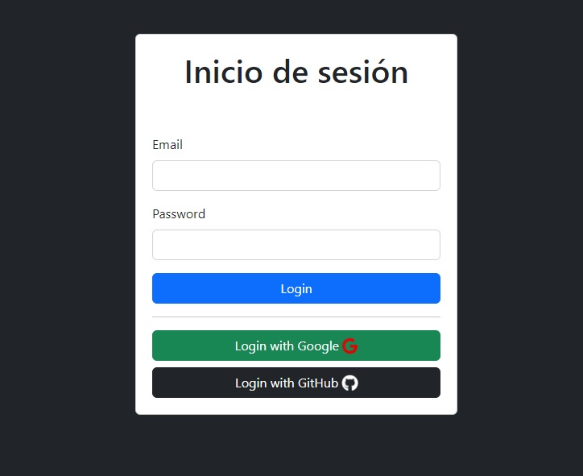
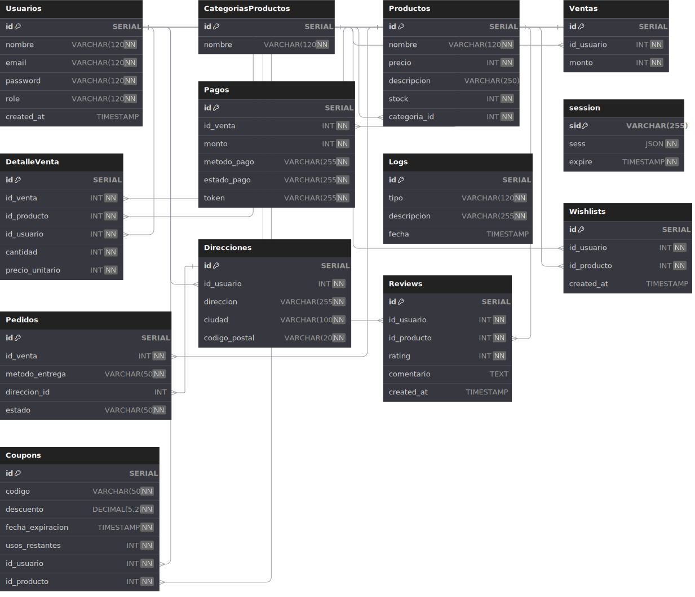

# Aplicación Web Node.js Express con Base de Datos MySQL

Este repositorio contiene una aplicación web desarrollada con Node.js y Express, utilizando una base de datos SQL alojada en Cloud. La aplicación proporciona servicios para gestionar usuarios, productos, ventas, pagos, historial de compras y carrito de compras. y otras rutas para gestionar un e-commerce.

### Proyecto Duoc-Uc


**URL**

Integración OAuth2.0 con Google y GitHub
```
https://api-mysql-duoc.onrender.com/auth/login


```
Nota: Por estar utilizando la capa gratuita en Render, el tiempo de carga puede ser de hasta 60 segundos después de un período de inactividad.




Este proyecto es parte del curso de Integracion de Plataformas, Duoc-UC.

## Configuración de la Base de Datos

La base de datos utilizada en esta aplicación cuenta con las siguientes tablas:

- **Usuarios**: Almacena información sobre los usuarios registrados en la plataforma.
- **CategoriasProductos**: Contiene las categorías de productos disponibles.
- **Productos**: Guarda los detalles de los productos disponibles para la venta.
- **Ventas**: Registra las ventas realizadas por los usuarios.
- **DetalleVenta**: Almacena los detalles de cada venta realizada, incluyendo los productos vendidos.
- **Pagos**: Registra los pagos asociados a cada venta.
- **Logs**: Contiene registros de eventos y acciones importantes dentro de la aplicación.
- **Pedidos**: Gestiona los pedidos y su estado.
- **Direcciones**: Guarda las direcciones de los usuarios.
- **Reviews**: Almacena las reseñas de productos realizadas por los usuarios.
- **Wishlists**: Guarda los productos que los usuarios desean comprar en el futuro.
- **Coupons**: Almacena los cupones de descuento disponibles.



## Script de la Base de Datos

Puedes encontrar el script de la base de datos en el siguiente archivo:

[Descargar Script SQL](images/db/api-duoc-db2024.sql) -Click derecho guardar como...


## Endpoints Disponibles

La aplicación proporciona los siguientes endpoints para interactuar con la API:

- `/auth`: 
  - `/login`: Endpoint para iniciar sesión en la plataforma.
  - `/logout`: Endpoint para cerrar sesión en la plataforma.

- `/carrito`: Endpoint para gestionar el carrito de compras.

- `/categorias-productos`: Endpoint para gestionar categorías de productos.

- `/coupons`: Endpoint para gestionar cupones de descuento.

- `/detalle-venta`: Endpoint para gestionar los detalles de las ventas.

- `/direcciones`: Endpoint para gestionar las direcciones de los usuarios.

- `/historial-compras`: Endpoint para visualizar el historial de compras.

- `/logs`: Endpoint para gestionar y visualizar los registros de eventos.

- `/pagos`: Endpoint para realizar y gestionar pagos.

- `/pedidos`: Endpoint para gestionar pedidos y su estado.

- `/productos`: Endpoint para gestionar productos.

- `/reviews`: Endpoint para gestionar reseñas de productos.

- `/usuarios`: Endpoint para gestionar usuarios .

- `/ventas`: Endpoint para gestionar ventas.

- `/wishlists`: Endpoint para gestionar los productos que podrian comprar los clientes.

## Middleware de Seguridad

La aplicación utiliza varios middleware de seguridad para protegerse contra amenazas comunes, como:

- `helmet`: Ayuda a configurar cabeceras HTTP para mejorar la seguridad.
- `morgan`: Registra los logs de las solicitudes HTTP.
- `body-parser`: Analiza los cuerpos de las solicitudes HTTP.
- `express-session`: Gestiona las sesiones de usuario.
- `passport`: Middleware de autenticación para Node.js.
- `cors`: Permite la comunicación entre aplicaciones desde diferentes orígenes.
- `express-validator`: Proporciona validaciones de datos para solicitudes HTTP.
- `dotenv`: Gestiona variables de entorno de manera segura.
- `connect-pg-simple`: Almacena las sesiones en una base de datos SQL.
- `oauth2.0-server`: Gestiona login/auth con plataformas externas.


## Integración con Transbank

Los pagos en esta aplicación están integrados con la API de Transbank para procesar transacciones de manera segura y eficiente en modo integracion.

## Contraseñas Cifradas

Las contraseñas de los usuarios se guardan cifradas utilizando el algoritmo bcrypt.

## Despliegue

La aplicación está alojada en Render.com, un servicio de alojamiento en la nube.

## Contribución

Si deseas contribuir a este proyecto, siéntete libre de hacer un fork del repositorio y enviar un pull request con tus mejoras.

## Estado del Proyecto

Este proyecto se encuentra en constante desarrollo. Siempre estamos buscando formas de mejorar.

### Integrantes del Grupo:

- Rodrigo Muñoz
- Cristhoper Sanchez
- Williams Diaz

Profesor(a): Ana Karina Villagran
